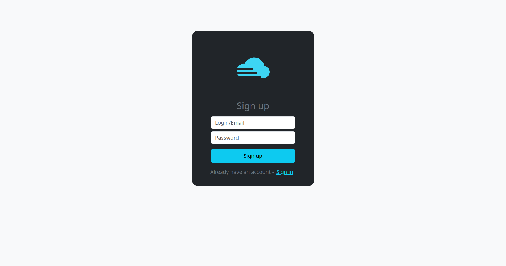
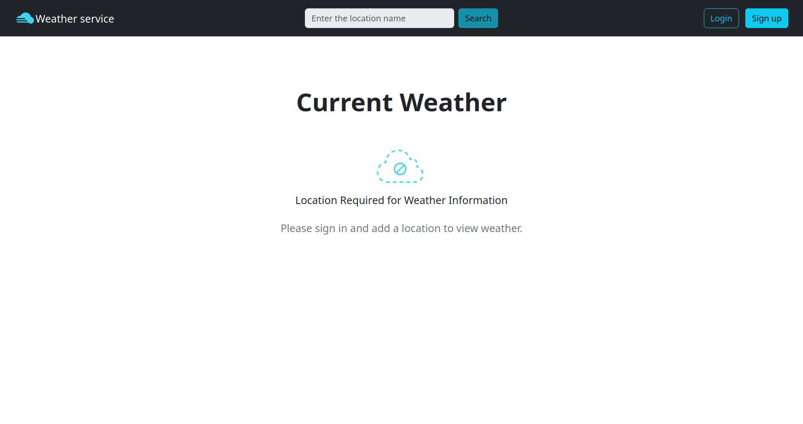
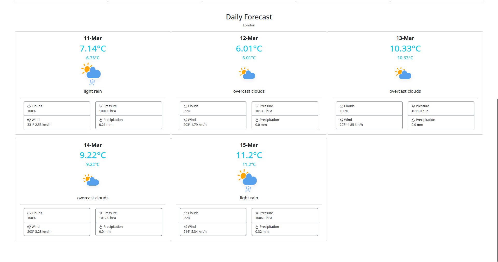

## Проект "Погода"

Автор идеи: https://github.com/zhukovsd

Авторское тз: https://zhukovsd.github.io/java-backend-learning-course/Projects/WeatherViewer/

## Стек

 - Java - коллекции, ООП
 - Паттерн MVC(S)
 - Maven/Gradle
 - Backend
    - Java сервлеты
    - GET и POST запросы, HTTP заголовки, cookies
    - Thymeleaf
 - Базы данных
   - Postgresql
   - Hibernate
 - Frontend - HTML/CSS, Bootstrap
 - Тесты - моки, JUnit 5

## Интерфейс приложения

Работа с пользователем:

 - Регистрация
   
 - Авторизация
   
 - Logout
   

Работа с локациями:
 - Поиск
   
 - Добавление в список
   
 - Просмотр почасового прогноза локации
   
- Просмотр ежедневный прогноза локации
  
 - Удаление из списка

## База данных

В качестве базы данных используется Postgresql

### Таблица `users`

| Колонка    | Тип     | Комментарий                                      |
|------------|---------|--------------------------------------------------|
| id         | int     | Айди пользователя, автоинкремент, первичный ключ |
| login      | varchar | Логин пользователя, username или email           |
| password   | varchar | Пароль пользователя. Шифруется AES               |
| public_key | varchar |                                                  |

### Таблица `locations`

| Колонка  | Тип     | Комментарий                                 |
|----------|---------|---------------------------------------------|
| id       | int     | Айди локации, автоинкремент, первичный ключ |
| name     | varchar | Название                                    |
| latitude | decimal | Широта локации                              |
| latitude | decimal | Долгота локации                             |

### Таблица `sessions`

| Колонка    | Тип      | Комментарий                                                        |
|------------|----------|--------------------------------------------------------------------|
| uuid       | varchar  | Айди сессии, UUID, первичный ключ                                  |
| user_id    | int      | Пользователь, для которого сессия создана                          |
| expires_at | datetime | Время истечения сессии. Равно времени создания сессии плюс N часов |

## Получение информации о погоде

Для получение информации о погоде используется OpenWeatherMap API

Api call для получения информации о текущей погоде

``
https://api.openweathermap.org/data/2.5/weather?lat={lat}&lon={lon}&appid={API key}
``

Api call для получения информации о погоде на 5 дней

``
https://api.openweathermap.org/data/2.5/forecast?lat={lat}&lon={lon}&appid={API key}
``
